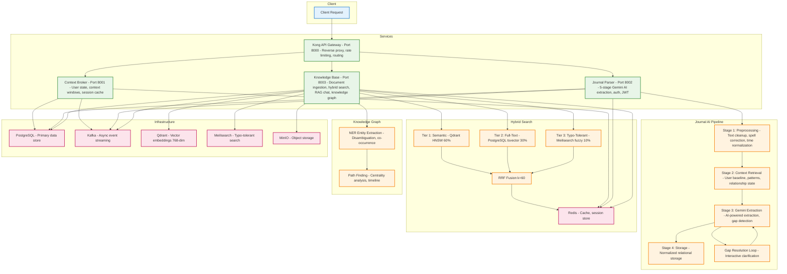

# PLOS Backend

Personal Life Operating System — an AI-powered backend that turns natural-language journal entries into structured life data, manages a personal knowledge base with hybrid search and RAG chat, and exposes everything through a multi-service API.

[](https://github.com/Sathish111j/PLOS-backend/actions/workflows/ci.yml)


Write a journal entry in plain English. PLOS extracts your sleep, mood, calories, activities, social interactions, locations, and health symptoms — stores them relationally — and lets you query them with natural language. Upload any document or URL and it lives in a searchable knowledge base with a knowledge graph, RAG chat, and AI-powered organisation.

[Quick Start](#quick-start) · [API](#api) · [Knowledge Base](#knowledge-base) · [Docs](#documentation) · [Coming Next](#coming-next)

---

## Highlights

- **Journal AI pipeline** — 5-stage extraction (preprocess → context retrieval → Gemini extraction → gap resolution → normalised storage), 9 data types, 80+ activity vocabulary, interactive gap-resolution loop
- **11 report types** — sleep, mood, calories, nutrition, social, health, work, activity, water, steps, and custom date ranges
- **Knowledge Base** — ingest text, PDF, images, Office files, and social URLs (Reddit, Twitter/X, LinkedIn, Instagram, YouTube) into a personal knowledge base
- **Hybrid search** — 3-tier RRF fusion: Qdrant semantic (768-dim) + PostgreSQL full-text + Meilisearch typo-tolerant, with cross-encoder reranking and MMR diversity
- **RAG chat** — Gemini-powered conversational search with source attribution over your own documents
- **Knowledge graph** — NER entity extraction, disambiguation, path finding, co-occurrence, centrality analysis, and timeline
- **AI bucket organisation** — documents auto-routed to buckets; hierarchical tree, bulk moves, route preview
- **Resilient Gemini client** — multi-key rotation, per-key quota tracking, task-type model dispatch
- **Multi-tenancy** — all data scoped by JWT user; anonymous graceful degradation
- **Observability** — Prometheus `/metrics`, structured logging, DLQ monitoring on every service

---

## Architecture



### Services

| Service | Port | Responsibility |
|---|---|---|
| `api-gateway` | 8000 | Kong DB-less reverse proxy, rate limiting, routing |
| `context-broker` | 8001 | User context state, Redis caching, context window management |
| `journal-parser` | 8002 | Journal ingestion, 5-stage Gemini AI extraction, 11 report types |
| `knowledge-base` | 8003 | Document ingestion, hybrid search, RAG chat, knowledge graph, bucket organisation |

### Infrastructure

| Component | Image | Purpose |
|---|---|---|
| PostgreSQL | `supabase/postgres:15.8.1.060` | Primary data store |
| Redis | `redis:7-alpine` | Cache, session store, search L2 cache |
| Qdrant | `qdrant/qdrant:v1.12.0` | Vector embeddings (768-dim) |
| Meilisearch | `getmeili/meilisearch:v1.11` | Typo-tolerant full-text search |
| MinIO | `minio/minio` | Object storage for raw documents |
| Kafka + Zookeeper | `confluentinc/cp-kafka:7.5.0` | Async event streaming |

---

## Prerequisites

- Docker Engine >= 24 with Compose plugin >= 2.x
- 8 GB RAM available to Docker
- A [Google Gemini API key](https://aistudio.google.com/)

---

## Quick Start

```bash
git clone https://github.com/Sathish111j/PLOS-backend.git
cd PLOS-backend

# First-time setup: checks prerequisites, creates .env
./scripts/setup/setup.sh

# Edit .env and set GEMINI_API_KEY (required)
# Then start the full stack
./scripts/start/dev.sh
```

`dev.sh` handles: infrastructure startup → DB readiness wait → schema migrations → seed → application services → health checks.

Verify everything is healthy:

```bash
./scripts/verify/verify-infrastructure.sh
./scripts/verify/smoke-e2e.sh   # end-to-end API smoke test
```

---

## Environment

Copy `.env.example` to `.env`. Minimum required variables:

```env
# Gemini — supports multi-key rotation (pipe-delimited, name optional)
GEMINI_API_KEYS=AIzaSy...key1|primary,AIzaSy...key2|backup-1

# Database
POSTGRES_USER=postgres
POSTGRES_PASSWORD=plos_db_secure_2025
POSTGRES_DB=plos

# Redis
REDIS_PASSWORD=plos_redis_secure_2025

# Meilisearch
MEILISEARCH_MASTER_KEY=plos_meili_secure_2025
```

Optional: `MINIO_ENABLED`, `USE_GEMINI_CACHING`, `LOG_LEVEL`, `GEMINI_API_KEY_ROTATION_ENABLED`, `GEMINI_API_KEY_ROTATION_BACKOFF_SECONDS`.

---

## Optional Profiles

Core services start by default. Optional services require explicit profiles:

```bash
docker compose --profile studio up -d      # Supabase Studio UI      :3000
docker compose --profile monitoring up -d  # Prometheus + Grafana    :9090 / :3333
docker compose --profile ui up -d          # Kafka UI                :18080
docker compose --profile bi up -d          # Metabase BI             :3001
docker compose --profile test up -d        # Isolated test environment
```

---

## API

All traffic goes through the gateway at `:8000`. Interactive docs at each service's `/docs` path.

### Auth

`POST /auth/register` — register · `POST /auth/login` — obtain JWT · `GET /auth/me` — current user

### Journal Parser

#### Ingestion and gap resolution

`POST /journal/process` — submit a journal entry (plain English); pass `require_complete: true` to enforce gap filling before storage.

`POST /journal/resolve-gap` · `POST /journal/resolve-paragraph` · `GET /journal/pending-gaps` — interactive gap-resolution loop when the AI needs clarification on missing data.

#### Reports — all support `weekly`, `monthly`, and `range` periods:

`/reports/overview` · `/reports/calories` · `/reports/sleep` · `/reports/mood` · `/reports/water` · `/reports/steps` · `/reports/activity` · `/reports/nutrition` · `/reports/social` · `/reports/health` · `/reports/work`

### Context Broker

`GET /context/{user_id}` · `POST /context/update` · `GET /context/{user_id}/summary` · `POST /context/{user_id}/invalidate`

### Knowledge Base

#### Documents — `POST /kb/upload` · `POST /kb/ingest` · `GET /kb/documents`

#### Buckets — `GET /kb/buckets` · `POST /kb/buckets` · `GET /kb/buckets/tree` · `POST /kb/buckets/{id}/move` · `DELETE /kb/buckets/{id}` · `POST /kb/buckets/bulk-move-documents` · `POST /kb/buckets/route-preview`

#### Search and chat — `POST /kb/search` (hybrid RRF) · `POST /kb/chat` (RAG with source attribution)

#### Knowledge graph — `GET /kb/graph/entity/search` · `GET /kb/graph/entity/{id}` · `GET /kb/graph/document/{doc_id}/entities` · `GET /kb/graph/related/{entity_id}` · `GET /kb/graph/path` · `GET /kb/graph/cooccurring` · `GET /kb/graph/centrality` · `GET /kb/graph/timeline` · `GET /kb/graph/stats`

#### Operations — `GET /kb/ops/embedding-dlq/stats` · `POST /kb/ops/embedding-dlq/reprocess-unreplayable` · `POST /kb/ops/embedding-dlq/purge-unreplayable`

Full endpoint reference: [docs/API_REFERENCE.md](docs/API_REFERENCE.md)

---

## Knowledge Base

The most feature-rich service. Details: [docs/KB_FEATURES_AND_FLOWS.md](docs/KB_FEATURES_AND_FLOWS.md)

#### Ingestion pipeline — base64 or URL → checksum deduplication → semantic chunking → 768-dim Gemini embeddings → Qdrant + Meilisearch + PostgreSQL → NER entity extraction → AI bucket routing → 4-stage integrity chain.

Supported formats: plain text, PDF, images, Office (docx/xlsx/pptx), web URLs, and social media URLs — Reddit, Twitter/X, LinkedIn, Instagram, YouTube.

#### Hybrid search — 3-tier RRF fusion across Qdrant (semantic, 60%), PostgreSQL tsvector (full-text, 30%), and Meilisearch (typo-tolerant, 10%). Dynamic intent weights auto-adjust per query type (conceptual / exact phrase / navigational / typo-heavy / filter-heavy). Cross-encoder reranking blends relevance, recency, engagement, and bucket context. Post-rerank MMR diversity. Two-layer cache: in-process LRU (5 min) + Redis (1 hr).

#### RAG chat — Gemini-powered, retrieves from your documents via hybrid search, returns answers with source attribution and session continuity.

#### Knowledge graph — NER entity extraction → disambiguation → Kuzu graph store. Query entity relations, find paths, rank by centrality, view co-occurrence clusters, and explore timelines.

#### Bucket organisation — four default buckets (Research and Reference / Work and Projects / Web and Media Saves / Needs Classification) created automatically. Hierarchical tree, AI auto-routing on ingest, bulk moves, route preview endpoint, protected defaults.

#### Deduplication — MD5 exact-match + chunk-level near-duplicate signatures, with Redis cache layer.

#### 4-stage integrity chain — each document tracks chain_hash + verified flag across: ingestion / chunking / embedding / entity extraction.

#### Error format — `{"detail": "...", "error_code": "AUTHENTICATION_FAILED|VALIDATION_ERROR|NOT_FOUND|RATE_LIMITED|INTERNAL_ERROR"}`

---

## Database Migrations

Migrations are tracked in `infrastructure/database/migrations/` and applied incrementally via `schema_migrations` table.

```bash
# Apply pending migrations
./scripts/setup/migrate.sh

# Seed initial data
./scripts/setup/seed.sh
```

The migration runner is idempotent — safe to run against an existing database.

---

## Repository Layout

```
PLOS-backend/
├── services/
│   ├── api-gateway/         Kong configuration (kong.yml, kong.conf)
│   ├── context-broker/      FastAPI service + Dockerfile
│   ├── journal-parser/      FastAPI service + Dockerfile
│   └── knowledge-base/      FastAPI service + Dockerfile + split requirements/
├── shared/
│   ├── auth/                JWT validation, user models, auth middleware
│   ├── gemini/              Resilient Gemini client with key rotation
│   ├── kafka/               Producer abstraction, topic definitions
│   ├── models/              Shared Pydantic models
│   └── utils/               Config, logging, metrics helpers
├── infrastructure/
│   ├── database/            init.sql, migrations/, seed.sql
│   ├── kafka/               init-topics.sh
│   ├── monitoring/          prometheus.yml, alerts.yml, Grafana provisioning
│   └── redis/               redis.conf
├── scripts/
│   ├── lint/lint.sh
│   ├── setup/{setup,migrate,seed}.sh
│   ├── start/dev.sh
│   ├── stop/stop.sh
│   ├── verify/{verify-infrastructure,smoke-e2e}.sh
│   └── dev-tools/           Local debugging scripts (not for CI)
├── tests/                   pytest integration and E2E tests
├── docs/                    Architecture, API reference, setup guides
├── docker-compose.yml
├── docker-compose.dev.yml   Volume mounts for hot reload
└── pyproject.toml           Linter config (black, ruff, isort)
```

---

## Development

### Linting

```bash
./scripts/lint/lint.sh          # check
./scripts/lint/lint.sh --fix    # auto-fix
```

Runs black, ruff, and isort against `services/` and `shared/`.

### Tests

```bash
pytest services/ shared/ tests/ -v
```

### Hot Reload (dev override)

`docker-compose.dev.yml` mounts local source into containers. Services restart on code change:

```bash
docker compose -f docker-compose.yml -f docker-compose.dev.yml up -d
```

### Stopping

```bash
./scripts/stop/stop.sh            # stop, keep volumes
./scripts/stop/stop.sh --clean    # stop and delete all data
```

---

## Documentation

| Doc | Contents |
|---|---|
| [docs/QUICKSTART.md](docs/QUICKSTART.md) | Step-by-step local setup |
| [docs/API_REFERENCE.md](docs/API_REFERENCE.md) | Full API reference for all services |
| [docs/ARCHITECTURE_STANDARDS.md](docs/ARCHITECTURE_STANDARDS.md) | Service design conventions |
| [docs/JOURNAL_PROCESSING_FLOW.md](docs/JOURNAL_PROCESSING_FLOW.md) | Journal → AI extraction → storage pipeline |
| [docs/KB_FEATURES_AND_FLOWS.md](docs/KB_FEATURES_AND_FLOWS.md) | Knowledge base ingestion and search |
| [docs/HYBRID_SEARCH_ARCHITECTURE.md](docs/HYBRID_SEARCH_ARCHITECTURE.md) | Qdrant + Meilisearch hybrid search design |
| [shared/gemini/DOCUMENTATION.md](shared/gemini/DOCUMENTATION.md) | Gemini client configuration and key rotation |

---

## Coming Next

**Telegram AI Integration** — natural-language journal input and knowledge base queries directly from Telegram. Send a message like "I ran 5 km and had oatmeal for breakfast" or "find my notes on machine learning" — the same Gemini pipeline processes it and responds in-chat, no app needed.

---

## Contributing

See [CONTRIBUTING.md](CONTRIBUTING.md).

---

*License: GPL-3.0-or-later*
